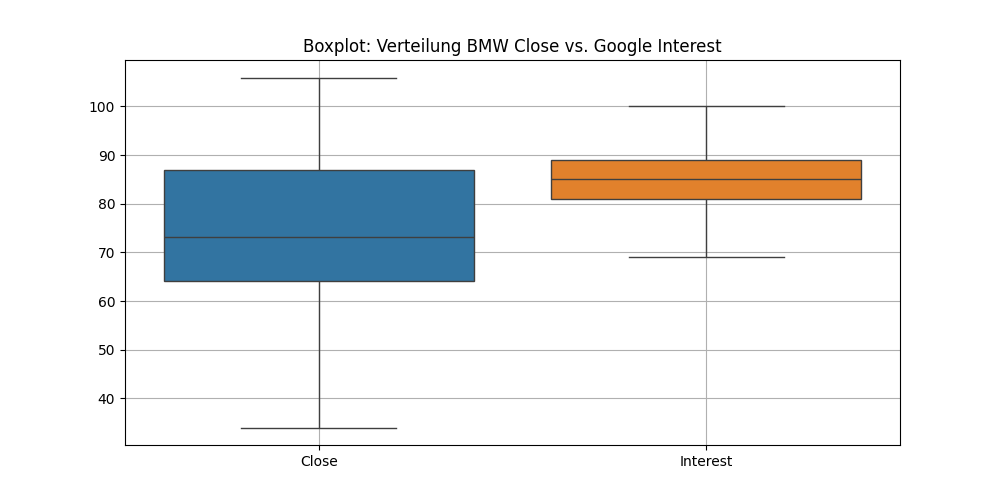
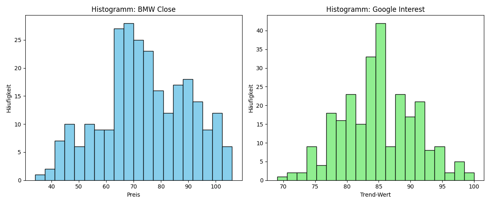
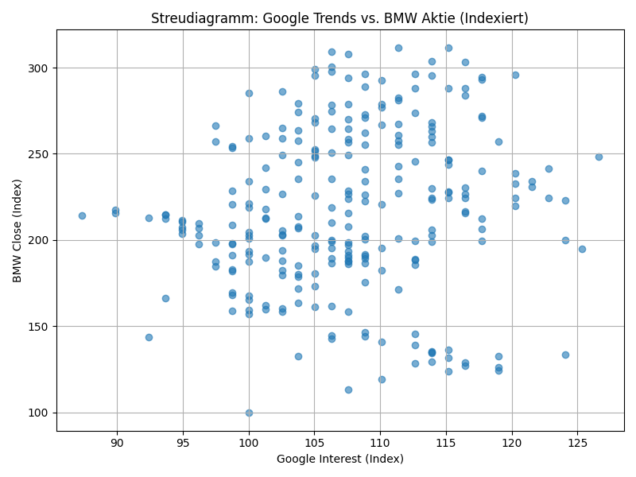
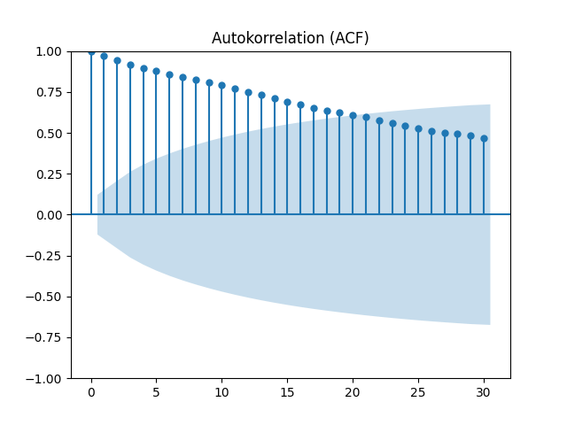
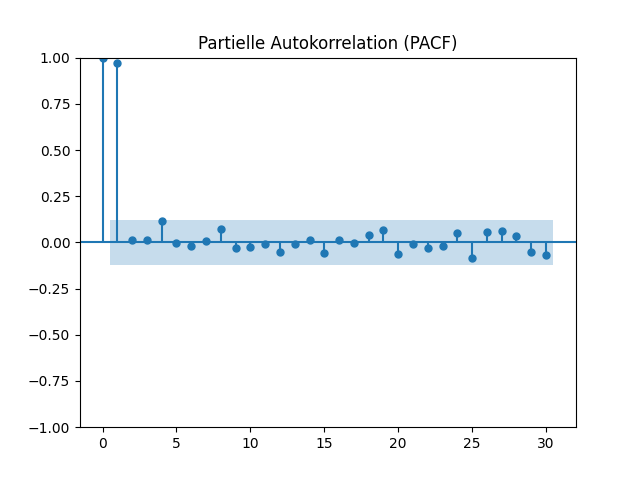
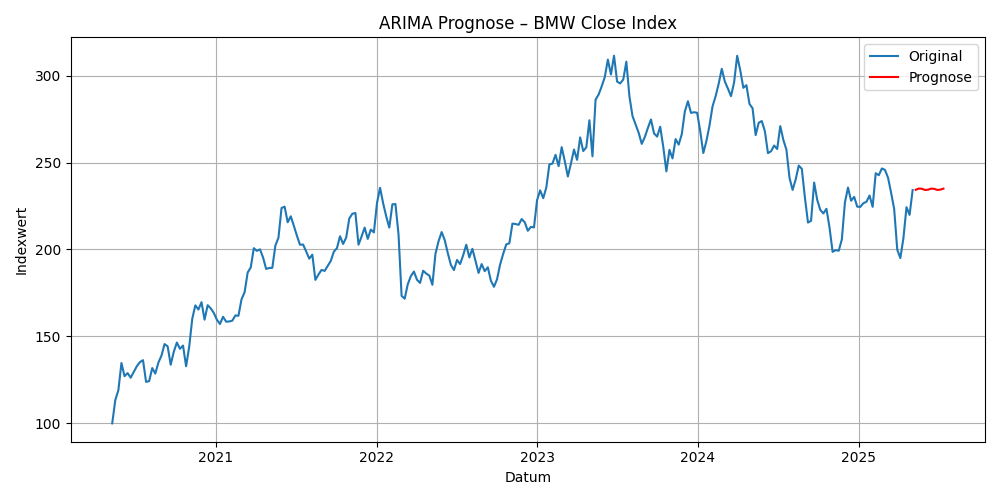

-------------------------------------------------------
## Zeitreihenanalyse: BMW Aktie vs. Google-Trends "BMW"
-------------------------------------------------------

### Projektziel:
Ziel dieses Projekts ist es, eine bivariate Zeitreihenanalyse durchzuführen, um zu untersuchen, ob ein Zusammenhang zwischen dem Google-Suchinteresse an "BMW" und der Kursentwicklung der BMW-Aktie besteht. Neben einer explorativen Analyse werden auch Prognosemodelle getestet.

---------------------------------------------------------------------------------
### Projektstruktur:
- data.exploration.py // Datenimport, Bereinigung, Indexbildung, Visualisierung
- descriptive_stats.py // Lagekennzahlen, Streuungsmaße, Wachstum, Korrelationen
- time_series_modeling.py // ARIMA & SARIMAX-Modelle inkl. Prognose
- daten_vereint.csv // Bereinigte, synchronisierte Zeitreihen (Google & BMW)
- Bilder_git
- README.md # Projektdokumentation
---------------------------------------------------------------------------------

---------------------------------------------------------------------------------
### Analyseüberblick
#### Datenquellen: 
- **BMW Aktie**: Historische Kursdaten (Yahoo Finance)
- **Google Trends**: Suchinteresse für den Begriff „BMW“ (Wöchentlich)

#### Datenaufbereitung
- Vereinheitlichung auf wöchentliche Frequenz
- Indexbildung mit Basiswert = 100
- Inner Join auf gemeinsame Datumswerte

#### Statistische Auswertung
- Lage- und Streuungsmaße (Mittelwert, Median, Varianz, etc.)
- Korrelations- und Kreuzkorrelationsanalyse (Lag-Analyse)
- Prüfung auf Stationarität (ADF-Test)

#### Modellierung
- **ARIMA**-Modell zur univariaten Prognose des BMW-Kurses
- **SARIMAX**-Modell mit Google Trends als exogene Variable
---------------------------------------------------------------------------------

### Ergebnisse: Hier erklären wir den Code und die Ergebnisse

data.exploration.py:
- Einlesen & Bereinigen der Daten
BMW-Aktie (bmw_aktie.csv)
Es wird ein Indexwert (Close_Index) berechnet: Close_Index = Close / Close[erste Zeile] * 100
-> Dadurch wird der Aktienkurs auf eine Basis von 100 normiert – das macht die Entwicklung vergleichbar.

- Google Trends (googletrends_bmw.csv)
Datei wird zeilenweise eingelesen, da das Google-Exportformat unregelmäßig ist.
Es wird richtig formatiert (Numerisch + Datumsformat).
Umbenannt zu "Date" -> damit Join mit der Aktie möglich ist.
Auch hier wird ein Index berechnet: Interest_Index = Interest / Interest[erste Zeile] * 100

- Zusammenführen (Join):
Beide Datenreihen werden über das Datum (Date) mit inner join verbunden.

Visualisierung

Bilder_git/vis_1.png
Interpretation:
BMW Aktie (blau): Schwankt stark – hohe Volatilität, vor allem 2023–2024
Google Trends (orange): Viel konstanter, leicht steigender Trend, keine heftigen Ausschläge
Beide Reihen starten bei Indexwert 100 (links am Anfang der Zeitachse)

Was fällt auf?
Die BMW-Aktie steigt über den Zeitraum stark an (auf über 300 Punkte indexiert), während Google Trends maximal leicht mitzieht
Kein klarer Gleichlauf → auf den ersten Blick nur schwache Korrelation
----------------------------------------------------------------------------------------------------------------------------------
descriptive_stats.py:
- Hier haben wir statistische Kennzahlen ausgerechnet:
  --- LAGEKENNZAHLEN ---

Mittelwerte:
BMW Aktie (Close): 74.02
BMW Index: 217.57
Google Trends: 84.93
Google Index: 107.51

Median:
BMW Aktie (Close): 73.11
BMW Index: 214.88
Google Trends: 85.0
Google Index: 107.59

Minimum:
BMW Aktie (Close): 34.02
Google Trends: 69

Maximum:
BMW Aktie (Close): 105.96
Google Trends: 100

-> Interpretation:
BMW hat hohe Streuung (34 – 106 €), Google Trends ist viel stabiler.
Der Mittelwert ≈ Median -> symmetrische Verteilung.

--- STREUUNGSMASSE ---

Standardabweichung:
BMW Close: 15.98
BMW Index: 46.97
Google Trends: 5.84
Google Index: 7.4

Varianz:
BMW Close: 255.33
BMW Index: 2205.79 -> hoch volatil
Google Trends: 34.16
Google Index: 54.74 -> geringe Schwankung

Range (Spannweite):
BMW Close: 71.94
Google Trends: 31

-> Interpretation:
BMW-Kurs ist deutlich volatiler als das Suchinteresse.

--- WACHSTUMSRATEN ---

Absolute Wachstumsrate:
BMW Aktie: 45.66 EUR (von 34.02 auf 79.68)

Relative Wachstumsrate:
BMW Aktie: 134.2 %

Indexbildung (erste Woche = 100):
Letzter Indexwert: 234.2

Google Trends:
  Absolute Wachstumsrate: 17
  Relative Wachstumsrate: 21.52 %

Indexbildung (letzter Wert):
  BMW Index: 234.2
  Google Index: 121.52

-> Die BMW-Aktie ist deutlich stärker gewachsen als das Suchinteresse.

--- ZUSAMMENHANGSMAßE ---

Korrelation (BMW Index vs. Google Index): 0.123

--- ZUSAMMENHANGSMAßE ---

Korrelation (BMW Index vs. Google Index): 0.123

Kreuzkorrelation mit Lag (Google voraus):
Lag 0 Wochen: 0.123
Lag 1 Wochen: 0.104
Lag 2 Wochen: 0.084
Lag 3 Wochen: 0.067
Lag 4 Wochen: 0.064
Lag 5 Wochen: 0.061

-> Interpretation:
Es gibt keine starke lineare Beziehung zwischen Google-Trends und BMW-Aktie.
Google-Trends erklären keine Kursveränderung zeitlich voraus.

Visualisierung: **** Grafik ist fehlerhaft - muss bearbeitet werden

- Was zeigt der Boxplot?
BMW Close (Aktienkurs): Hat eine größere Streuung und Ausreißer nach unten (unterhalb der unteren "Whiskers").
Google Interest (Suchvolumen): Deutlich konzentrierter um den Median, wenig Ausreißer.

- Interpretation:
Der Aktienkurs ist volatiler als das Google-Suchinteresse.
Die Verteilung von „Interest“ ist symmetrischer und stabiler.

- Links: BMW Close
Leichte Rechtsschiefe (mehr hohe Werte), aber relativ symmetrisch.
Hohe Frequenz bei Kursen zwischen 65 € und 90 €.

- Rechts: Google Interest
Deutlichere Glockenkurve -> fast normalverteilt.
Mehrheit der Werte zwischen 80 und 90.

- Interpretation:
BMW-Kurse schwanken stärker 
Google-Trends ist konzentrierter und normal verteilt – zeigt gleichmäßiges Nutzerinteresse über die Zeit.

- Was sehen wir?
Jeder Punkt ist ein Zeitpunkt (Woche).
X-Achse: Google-Suchinteresse (Index)
Y-Achse: BMW-Kurs (Index)

- Interpretation:
Die Punkte sind weit gestreut, keine klare lineare Beziehung.
Korrelation ist sehr schwach positiv (wie auch der berechnete Korrelationswert: 0.123).
Es scheint kein starker Zusammenhang zu bestehen – das Interesse in Google beeinflusst die Aktie nicht direkt messbar.
----------------------------------------------------------------------------------------------------------------------------
time_series_modeling.py:
- ARIMA-Modell (nur auf Basis der Zeitreihe selbst)

- SARIMAX-Modell (mit Einfluss externer Variable: Google-Trends)

Teil 1: ARIMA
Wir verwenden Close_Index (also die BMW-Aktie, indexiert mit Basis 100).
ARIMA(2,1,2) bedeutet:
AR(2): Die letzten 2 Werte beeinflussen die aktuelle Schätzung.
I(1): 1-fache Differenzierung → Zeitreihe war nicht stationär.
MA(2): Fehlerterme der letzten 2 Zeitpunkte werden berücksichtig.

ar.L1 = -0.0291 (nicht signifikant)
ar.L2 = -0.9418 (signifikant)
ma.L1 =  0.0945 (signifikant)
ma.L2 =  0.9746 (signifikant)

AR(2) ist sehr stark -> Kursentwicklung ist autokorreliert.

Teil 2: SARIMAX-Modell
Hier modellieren wir dieselbe Aktie mit Google Trends als erklärende Variable (Interest_Index).
Wir testen: Erklären Trends das Kursverhalten?

Interest_Index     0.0075   (nicht signifikant, p=0.945)

Der Rest ist ähnlich zum ARIMA-Modell:
Gute Modellanpassung, aber kaum Unterschiede in den Prognosewerten.
2025-05-11    234.33
2025-05-18    235.05

Visualisierung:

- Was wir sehen:
Die ACF zeigt, wie stark die Zeitreihe (BMW Close Index) mit ihren eigenen verzögerten Werten korreliert ist (Lag = Verzögerung in Wochen).

- Interpretation:
Der ACF-Verlauf nimmt langsam ab → Hinweis auf Nicht-Stationarität.
Viele Lags (Verzögerungen) liegen außerhalb des Konfidenzintervalls -> es gibt eine signifikante Autokorrelation, d. h. vergangene Werte haben Einfluss auf aktuelle.

- Was wir sehen:
Die PACF zeigt, wie stark ein einzelner verzögerter Wert die Zeitreihe beeinflusst, nachdem der Einfluss kürzerer Lags entfernt wurde.

- Interpretation:
Starke Korrelation nur bei Lag 1 → geeignetes AR-Modell könnte z. B. AR(1) sein.
Ab Lag 2 ist fast alles innerhalb des Konfidenzintervalls → höhere Lags bringen wenig Zusatzinformation.

- Was wir sehen:
Die blaue Linie zeigt die tatsächlichen Werte des BMW Index (indexiert auf 100).
Die rote Linie zeigt die ARIMA-Prognose für die nächsten 10 Wochen.

Interpretation:
Die Prognose ist relativ stabil und folgt dem letzten Trend → typisch für Zeitreihen mit schwacher Trenddynamik.
ARIMA nutzt nur vergangene BMW-Werte, keine externe Information.

)
Was wir sehen:
Die blaue Linie ist wieder der BMW Index.
Die orange Linie zeigt die SARIMAX-Prognose, basierend auf BMW Index + Google Trends Index als exogene Variable.

Interpretation:
Die Prognose verläuft fast identisch wie bei ARIMA → Google Trends liefert kaum zusätzlichen Prognosewert.
Das Modell hat den Exogenen Einfluss von Interest_Index als statistisch insignifikant bewertet (siehe coef = 0.0075, p = 0.945 im Modelloutput).

### Fazit: 
- Deskriptive Erkenntnisse
Die BMW-Aktie zeigt eine deutlich höhere Volatilität (Spannweite ~72 €) als das Google-Trends-Interesse (nur ~31 Punkte).
Die Verteilungen beider Reihen sind leicht rechtsschief, aber ohne gravierende Ausreißer.
Das Google-Suchinteresse ist über die Zeit vergleichsweise stabil, der Aktienkurs jedoch stark schwankend.

- Zusammenhangsanalyse
Die lineare Korrelation zwischen BMW-Aktie und Google-Trends ist schwach positiv (r ≈ 0.12).
Auch die Kreuzkorrelation mit Lags (0–20 Wochen) zeigt kein klares Vorlaufsignal → Google-Trends „führen“ den Kurs nicht signifikant.
-> Es gibt keine starke kurzfristige Kopplung, aber ein leichter Gleichlauf ist sichtbar.

- Modellierung und Prognose
Das ARIMA-Modell konnte die Zeitreihe gut abbilden und eine plausible kurzfristige Prognose liefern.
Ein erweitertes SARIMAX-Modell mit Google Trends brachte keine Verbesserung:
Der Google-Index war statistisch insignifikant im Modell (p ≈ 0.95).
-> Die Google-Suchanfragen tragen in diesem Fall keine zusätzliche prognostische Information zur BMW-Aktie bei.

- Limitationen und Ausblick
Die Analyse basiert nur auf einer exogenen Variable (Google Trends „BMW“)
Weitere Variablen wie News-Sentiment, Absatzberichte oder Makrofaktoren könnten relevant sein.
Auch andere Modellklassen wie VAR/VECM, Machine Learning Modelle oder nichtlineare Ansätze könnten in Zukunft getestet werden.
--------------------------------------------------------------------------------------------------------------------------------------------------
1. Reposition klonen:
   git clone https://github.com/NoahSPBBA/SPBBA.git
2. Benötigte Libraries:
   - `pandas`, `matplotlib`, `seaborn`, `statsmodels`
---------------------------------------------------------------------------------------------------------------------------------------------------

### Projektbeteiligte
- Antonia Strohmenger
- Noah Wolf
