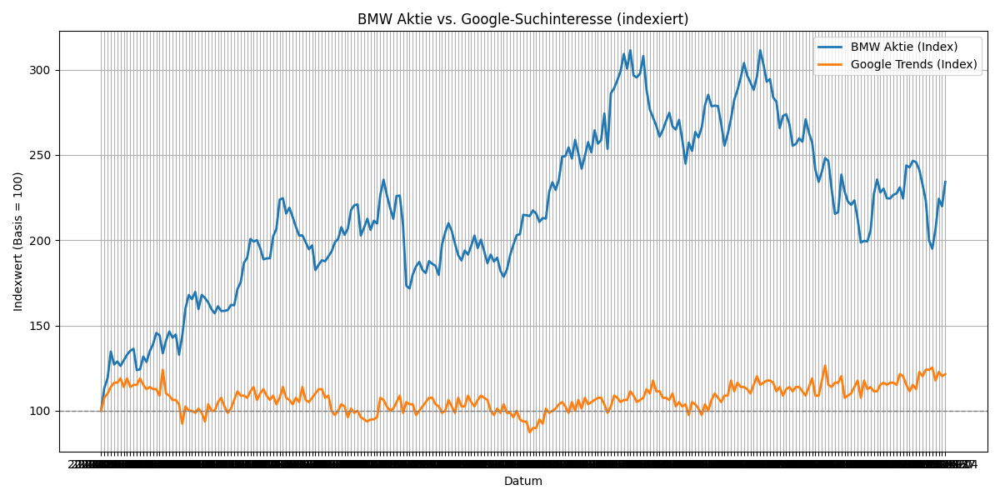

-------------------------------------------------------
## Zeitreihenanalyse: BMW Aktie vs. Google-Trends "BMW"
-------------------------------------------------------

### Projektziel:
Ziel dieses Projekts ist es, eine bivariate Zeitreihenanalyse durchzuführen, um zu untersuchen, ob ein Zusammenhang zwischen dem Google-Suchinteresse an "BMW" und der Kursentwicklung der BMW-Aktie besteht. Neben einer explorativen Analyse werden auch Prognosemodelle getestet.

---------------------------------------------------------------------------------
### Projektstruktur:
- data.exploration.py // Datenimport, Bereinigung, Indexbildung, Visualisierung
- descriptive_stats.py // Lagekennzahlen, Streuungsmaße, Wachstum, Korrelationen
- time_series_modeling.py // ARIMA & SARIMAX-Modelle inkl. Prognose
- daten_vereint.csv // Bereinigte, synchronisierte Zeitreihen (Google & BMW)
- README.md # Projektdokumentation
---------------------------------------------------------------------------------

---------------------------------------------------------------------------------
### Analyseüberblick
#### Datenquellen: 
- **BMW Aktie**: Historische Kursdaten (Yahoo Finance)
- **Google Trends**: Suchinteresse für den Begriff „BMW“ (Wöchentlich)

#### Datenaufbereitung
- Vereinheitlichung auf wöchentliche Frequenz
- Indexbildung mit Basiswert = 100
- Inner Join auf gemeinsame Datumswerte

#### Statistische Auswertung
- Lage- und Streuungsmaße (Mittelwert, Median, Varianz, etc.)
- Korrelations- und Kreuzkorrelationsanalyse (Lag-Analyse)
- Prüfung auf Stationarität (ADF-Test)

#### Modellierung
- **ARIMA**-Modell zur univariaten Prognose des BMW-Kurses
- **SARIMAX**-Modell mit Google Trends als exogene Variable
---------------------------------------------------------------------------------

### Ergebnisse: Hier erklären wir den Code und die Ergebnisse

data.exploration.py:
- Einlesen & Bereinigen der Daten
BMW-Aktie (bmw_aktie.csv)
Nur Spalten Date und Close werden verwendet.
Es wird ein Indexwert (Close_Index) berechnet: Close_Index = Close / Close[erste Zeile] * 100
-> Dadurch wird der Aktienkurs auf eine Basis von 100 normiert – das macht die Entwicklung vergleichbar.

- Google Trends (googletrends_bmw.csv)
Datei wird zeilenweise eingelesen, da das Google-Exportformat unregelmäßig ist.
Es wird die Spalte "Interest" bereinigt (Numerisch + Datumsformat).
Umbenannt zu "Date" -> damit Join mit der Aktie möglich ist.
Auch hier wird ein Index berechnet: Interest_Index = Interest / Interest[erste Zeile] * 100

- Zusammenführen (Join)
Beide Datenreihen werden über das Datum (Date) mit inner join verbunden.

Bilder_git/vis_1.png
Interpretation:
BMW Aktie (blau): Schwankt stark – hohe Volatilität, vor allem 2023–2024
Google Trends (orange): Viel konstanter, leicht steigender Trend, keine heftigen Ausschläge
Beide Reihen starten bei Indexwert 100 (links am Anfang der Zeitachse)

Was fällt auf?
Die BMW-Aktie steigt über den Zeitraum stark an (auf über 300 Punkte indexiert), während Google Trends maximal leicht mitzieht
Kein klarer Gleichlauf → auf den ersten Blick nur schwache Korrelation

- **Korrelation**: Nur schwacher Zusammenhang zwischen Google Trends und BMW-Aktie
- **Kreuzkorrelation**: Kein klarer Vorlaufeffekt beobachtbar
- **SARIMAX**: Kein signifikanter Einfluss des Google-Suchinteresses
- **ARIMA-Prognose**: Stabile, plausible Vorhersage ohne externe Variablen

  

1. Reposition klonen:
   git clone https://github.com/NoahSPBBA/SPBBA.git
2. Benötigte Libraries:
   - `pandas`, `matplotlib`, `seaborn`
  - `statsmodels`

### Projektbeteiligte
Antonia Strohmenger
Noah Wolf
